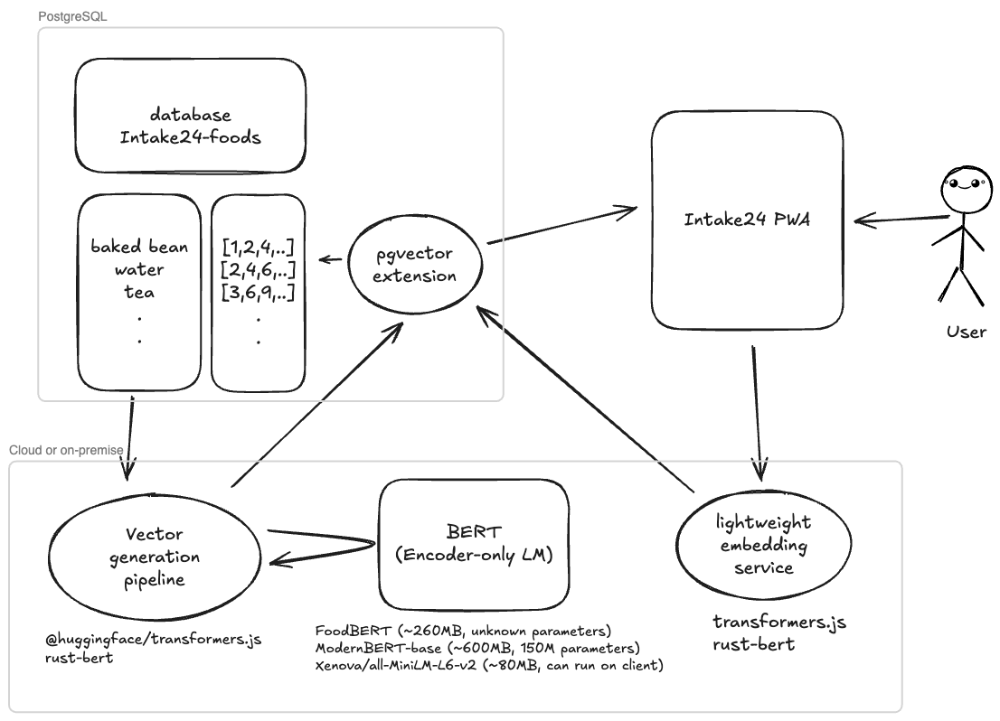

# Minimal Local Food Search Proof-of-Concept

A full-stack application for searching foods using semantic embeddings and vector similarity in PostgreSQL (with pgvector).

<p align="center">
   
</p>

## Features

- Vue 3 frontend for searching foods
- Node.js/Express API server with semantic search endpoint
- PostgreSQL with pgvector for vector similarity search
- Embedding generation using HuggingFace Transformers
- Docker Compose for easy local development

## Project Structure

```
app/                # Vue 3 frontend
api/            # Node.js/Express API server, embedding scripts, utilities
compose.yaml           # Docker Compose setup
init/                  # Initialization scripts for database
db/                    # Database schema and sample data (via `pg_restore`)
```

## Getting Started

### Prerequisites

- Node.js (22+ recommended)
- pnpm (or npm/yarn)
- Docker & Docker Compose

### Setup

1. **Clone the repository:**
   ```sh
   git clone <your-repo-url>
   cd foodSearcher
   ```
2. **Install dependencies:**
   ```sh
   pnpm install
   ```
3. **Start the database and Adminer:**

   You may install PostgreSQL with Pgvector by

   ```bash
   # On Ubuntu
   # Note: Replace `17` with your Postgres server version
   sudo apt install postgresql-17-pgvector
   ```

   Or using Docker (recommended in this test)

   ```docker
   docker compose up -d
   # Adminer available at http://localhost:8080
   ```

   To reset the database AND remove volume it created, you can run:

   ```sh
   docker compose down -v
   ```

   After importing the `foods` table from `public.foods` in `Intake24`, enable pgvector and create a model-specific vector column.

   The embedder and API derive the embedding column name from EMBEDDING_MODEL as:
   - embedded\_<sanitized MODEL_ID>
   - Sanitization: lowercase; replace any character outside `[A-Za-z0-9_]` with `_`

   Examples:
   - Xenova/all-MiniLM-L6-v2 → embedded_xenova_all_minilm_l6_v2 (dim 384)
   - onnx-community/embeddinggemma-300m-ONNX → embedded_onnx_community_embeddinggemma_300m_onnx

   Create the extension and the appropriate column (dimension must match your model):

   ```sql
   -- Enable pgvector (once per database)
   CREATE EXTENSION IF NOT EXISTS vector;

   -- Ensure code uniqueness (optional)
   ALTER TABLE foods ADD CONSTRAINT unique_code UNIQUE (code);

   -- Example for MiniLM (384-dim)
   ALTER TABLE foods ADD COLUMN embedded_xenova_all_minilm_l6_v2 vector(384);
   ```

   Or, for merely testing purposes, instead of importing `foods` table from `public.foods` in `Intake24`, you can also use `pg_restore` to import a sample foods dataset

   ```sh
   pg_restore -h localhost -p 55432 -U postgres -d postgres -v db/dump-postgres.sql
   ```

4. **Run the embedding script:**

   ```sh
   pnpm db:embed
   ```

   > [!NOTE]
   > Occassionally, you will need to run this to refresh the embeddings (e.g. new foods added).

5. **Start the web app**
   You can run both API server and web server in a single line:

```sh
pnpm start
```

If you wish to start separately, you can

**_Start the API server:_**

```sh
pnpm api
```

API available at http://localhost:3000

**_Start the frontend:_**

```sh
pnpm app
```

App available at http://localhost:5173

## Usage

- Search for foods using the web UI.
- The backend will return the most similar foods using vector search.

## Testing (API) 🧪

The API package uses Vitest for unit, health, and evaluation tests.

Prerequisites:

- API server running at http://localhost:3000
- PostgreSQL available and `foods` table embedded

Start the API in a separate terminal:

```sh
pnpm --filter foodsearcher-api api
```

Install deps (once):

```sh
pnpm --filter foodsearcher-api install
```

Run all tests (non-watch):

```sh
pnpm --filter foodsearcher-api test:run
```

Run in watch mode:

```sh
pnpm --filter foodsearcher-api test:watch
```

Run the MRR evaluation only:

```sh
# By file
pnpm --filter foodsearcher-api test:run -- src/test/mrr.test.ts

# Or by test name pattern
pnpm --filter foodsearcher-api test:run -t "Mean Reciprocal Rank"
```

What MRR test does:

- Loads `api/src/test/data/search-terms-vs-food.json`.
- Samples up to 5,000 unique non-empty queries.
- Calls `POST /search` and computes Mean Reciprocal Rank at cutoffs:
  - MRR@1, MRR@10, MRR@50 (logged in the output)
- Retries requests when the model is still loading (HTTP 503).

Tips:

- If you see 503s for a while, wait until the server logs show the model is ready, then re-run.
- To speed up, reduce the sample size inside `api/src/test/mrr.test.ts` or lower concurrency.

## Model & Embedding Configuration ⚙️

Environment variables (set in `api/.env` or your shell):

- `EMBEDDING_MODEL` — Hugging Face model id used for feature extraction.
  - Default: `Xenova/all-MiniLM-L6-v2` (384-dim embeddings)
  - Use a feature-extraction/bi-encoder model (e.g., `Xenova/all-MiniLM-L6-v2`, `Xenova/bge-small-en-v1.5`, `Xenova/bge-m3`).
  - Avoid rerankers/cross-encoders (e.g., `bge-reranker-*`) — they don’t produce per-text embeddings.
- `TRANSFORMERS_CACHE` — directory for model cache (default: `<repo>/.cache/transformers`).

Derived embedding column

- The embedder writes to, and the API reads from, a model-specific column named:
  - `embedded_<sanitized MODEL_ID>`
  - Sanitization: lowercase and replace any character outside `[A-Za-z0-9_]` with `_`.

Examples:

- `Xenova/all-MiniLM-L6-v2` → `embedded_xenova_all_minilm_l6_v2` (vector(384))
- `onnx-community/embeddinggemma-300m-ONNX` → `embedded_onnx_community_embeddinggemma_300m_onnx`

Schema preparation (pick the right dimension for your model):

```sql
-- Enable pgvector (once per database)
CREATE EXTENSION IF NOT EXISTS vector;

-- Ensure code uniqueness (optional)
ALTER TABLE foods ADD CONSTRAINT unique_code UNIQUE (code);

-- Example for MiniLM (384-dim)
ALTER TABLE foods ADD COLUMN embedded_xenova_all_minilm_l6_v2 vector(384);
```

Notes:

- If you switch models, add a new column for the new dimension; the server will automatically query the column derived from `EMBEDDING_MODEL`.
- Ensure the vector dimension matches the selected model; mismatches will cause database errors.

## Development

- Edit frontend in `app`
- Edit embedding scripts and API server in `api`

## License

MIT
